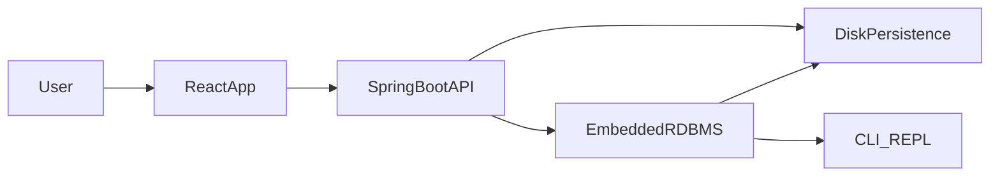

# Ledgerly Mini-RDBMS — Architecture & Core Contracts

This document captures the agreed scope and contracts for the mini-RDBMS challenge implementation (Java/Spring Boot core + API, optional React demo, Dockerized).

## Goals
- Provide a small, inspectable RDBMS core: schema, constraints, CRUD, simple queries/joins, basic indexing, persistence and restart integrity.
- Expose a minimal REST API over the core for the demo app and curl-based testing.
- Offer a REPL to exercise the engine directly without the web layer.
- Keep run/setup simple: `docker-compose up` with a data volume; optional seeded tables; REPL entry via a single compose command.

## High-Level Architecture

## Core Contracts (Engine)
- **Data types (initial set):** `INT` (64-bit), `STRING` (UTF-8), `TIMESTAMP` (ISO-8601 parsed to epoch millis). Optional later: `BOOLEAN`.
- **DDL syntax (supported):**
  - `CREATE TABLE <name> (col TYPE [NOT NULL], ..., PRIMARY KEY (colA [, colB...]), UNIQUE (colX [, colY...])...)`
  - Names: lowercase, alnum + underscore; unique per table.
  - Constraints: exactly one primary key (composite allowed); zero or more UNIQUEs; PK columns implicitly NOT NULL.
- **DML ops:**
  - `INSERT INTO <table> (cols...) VALUES (...)`
  - `UPDATE <table> SET col=val [, ...] WHERE <predicate>`
  - `DELETE FROM <table> WHERE <predicate>`
- **Queries:**
  - `SELECT col1[, col2...] FROM <table> [WHERE <predicate>]`
  - Predicates: AND-only conjunctions; operators `=, !=, <, <=, >, >=` for INT/TIMESTAMP; `=, !=` for STRING; `IS NULL / IS NOT NULL`.
- **Joins (minimal):**
  - Single inner join: `SELECT ... FROM A JOIN B ON A.pk = B.fk` (or specified columns).
  - Implementation: nested-loop with index assist on join key when available.
- **Indexing:**
  - In-memory hash index for primary key and each UNIQUE constraint.
  - Rebuilt on startup from snapshot/log if not persisted separately.
- **Persistence:**
  - Append-only WAL for DDL/DML events.
  - Periodic snapshot (per table or global) to bound replay time.
  - Startup: load latest snapshot, then replay WAL tail.
  - Storage dir configurable; default mapped to a Docker volume.
- **Seeding:**
  - On first run (empty data dir), load sample schema/data (e.g., `customers`, `orders`) to enable immediate queries.
  - Env/flag to skip seeding.
- **REPL commands:**
  - `HELP`, `SHOW TABLES`, `DESCRIBE <table>`
  - `CREATE TABLE ...`, `INSERT ...`, `UPDATE ... WHERE ...`, `DELETE ... WHERE ...`
  - `SELECT ... FROM ... [WHERE ...] [JOIN ... ON ...]`
  - `EXIT` / `QUIT`
- **Error surfaces:**
  - Constraint violations (PK/UNIQUE), nullability, type errors, missing table/column, invalid predicate operator/type mismatch, snapshot/log load errors.

## API Surface (minimal, to implement)
- `POST /tables` — create table (DDL).
- `POST /tables/{table}/rows` — insert.
- `PUT /tables/{table}/rows` — update with simple filter.
- `DELETE /tables/{table}/rows` — delete with simple filter.
- `POST /tables/{table}/query` — select with filters/projection.
- `POST /join` — minimal inner-join request (specify left/right tables and join columns).
- Errors map engine errors to HTTP 400 (validation/constraints) or 500 (internal).

## REPL & Runtime
- Same JAR contains API and REPL. Spring Boot main runs HTTP; a CLI entrypoint (or profile/flag) runs REPL using the same engine.
- Compose helper: `docker-compose run api ./app --repl` (exact command to be set).

## Docker & Run Simplicity
- `docker-compose up` brings up API (and optional frontend) with a named volume for storage.
- Default seed on first run; allow disabling via env.
- Provide curl smoke tests in README (create table optional if seed enabled, insert/select/join).

## Frontend (later, minimal)
- React UI that calls the API: basic CRUD page + a join view.
- Preconfigured API URL; no extra setup beyond compose.

## Next Steps
- Implement core engine packages (schema, storage, index, query, persistence).
- Wire Spring Boot API controllers/DTOs to engine.
- Add REPL entrypoint.
- Add Dockerfile and compose with volume + REPL helper command.
