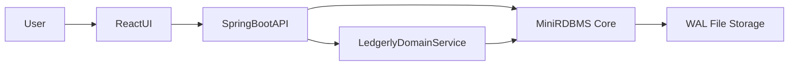
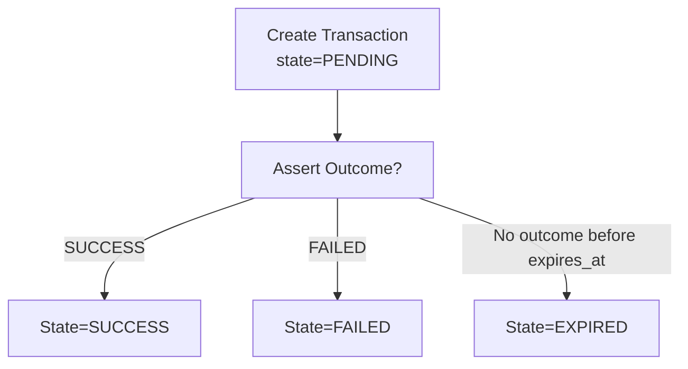

# Ledgerly Mini-RDBMS & Ledgerly Domain Demo

Comprehensive mini-RDBMS (Java/Spring Boot) with file-based persistence (WAL), REST API, REPL, and a minimal React UI. Includes a Ledgerly-flavored domain overlay (merchants, transactions, outcomes, expiration) to showcase a transaction lifecycle on top of the custom engine.

## Overview
This project demonstrates a self-contained mini-RDBMS built from first principles (no external DB), plus a Ledgerly-inspired domain: onboarding merchants, recording transactions, asserting outcomes, and handling expirations. It illustrates durability via a JSONL write-ahead log, schema-backed tables, domain validation, idempotent flows, and a lightweight UI/REPL surface to exercise the system end-to-end.

## Features
- Core engine: schema-backed tables with PK/unique enforcement, typed columns (INT, STRING, TIMESTAMP), CRUD, filtered selects, simple inner join, in-memory indexes for quick lookups, and predicate-based updates/deletes.
- Persistence: append-only JSONL WAL with replay on startup; configurable data directory for easy relocation or volume mounting.
- Domain overlay: merchants, transactions (PENDING/SUCCESS/FAILED/EXPIRED), outcomes, and an expiration sweep; transaction creation validates merchant existence, outcome assertion enforces state transitions and idempotency.
- Interfaces: REST API for automation, REPL for quick probes, and a styled React UI to inspect flows visually (filters, seeding, outcomes).
- Dockerized: one-command bring-up with persisted volume; frontend build preconfigured to talk to the backend.

## Architecture
### System (high level)


### Ledgerly domain flow (transaction lifecycle)


## Data Model & State Machine
- Core demo tables (generic): `customers`, `orders` (seeded for basic CRUD/join demo).
- Ledgerly tables:
  - `merchants(id, name, status, created_at)`
  - `transactions(id, merchant_id, amount, currency, state, created_at, expires_at, metadata)`
  - `outcomes(tx_id, status, external_reference, reported_at, metadata)`
- States: PENDING → (SUCCESS | FAILED | EXPIRED). Outcome assertion allowed only from PENDING.

## Persistence & Seeding
- Persistence: append-only WAL at `data/ledgerly-wal.jsonl` (or mounted volume). Reloads on boot by replaying WAL.
- Seeding:
  - Generic seed (customers/orders).
  - Ledgerly seed (merchant + transactions + outcome) controlled by `ledgerly.seed.domain-enabled` (default true).
- Config: `ledgerly.data-dir` (default `data`), `ledgerly.seed.domain-enabled` (default true).

## Running the Stack

### Docker Compose (primary)
```sh
docker compose up --build
```
- Backend: http://localhost:8080
- Frontend: http://localhost:4173
- Data persisted in volume `ledgerly-data`.
- REPL is disabled by default (`LEDGERLY_REPL_ENABLED=false`).
- Frontend build arg points to backend `http://localhost:8080`.
- View backend logs: `docker compose logs -f backend`
- If you see `version` is obsolete warning, it is benign; you can remove the `version:` line to silence it.

### REPL (one-off, via compose)
```sh
docker compose run --rm --service-ports --tty \
  backend \
  java -jar /app/app.jar --spring.main.web-application-type=none --ledgerly.repl.enabled=true
```
Interaction (prompt is `>`), useful for quick integrity checks without HTTP:
- Core commands:
  - `help` — list commands with examples
  - `tables` — list table names
  - `describe <table>` — show schema
  - `create <table> <schemaJson>` — define table (columns, primaryKey, optional unique)
    - Example: `create demo {"columns":[{"name":"id","type":"INT"},{"name":"name","type":"STRING"}],"primaryKey":["id"],"unique":[["name"]]}`
  - `insert <table> <json>` — insert row
  - `select <table> [col1,col2] [col=val,...]` — optional projection + equality filters
  - `update <table> col=val,... <json>` — update rows matching filters
  - `delete <table> col=val` — delete matching rows
  - `join <left> <right> <lCol> <rCol> [proj1,proj2]` — inner join with optional projection
  - `quit` — exit
- Domain commands:
  - `merchant:create <json>` — create merchant
  - `tx:create <json>` — create transaction
  - `tx:get <id>` — fetch transaction
  - `tx:list` — list transactions
  - `tx:outcome <id> <json>` — assert outcome
  - `tx:expire` — expire pending past `expires_at`
- Notes: errors (e.g., constraint violations, missing merchant) are printed as `Error: <message>`; timestamps must be ISO-8601; amounts are numeric (cents).

#### WAL replay note
- The engine replays `data/ledgerly-wal.jsonl` on startup. If a WAL becomes corrupted or schema changes make old WAL incompatible, you can reset state by removing the WAL (e.g., `docker compose down -v` to drop the volume) or rebuild with a clean data dir. Otherwise, keep WAL to preserve state.

### Local backend (without Docker)
```sh
cd backend
mvn spring-boot:run
```
Env: `LEDGERLY_DATA_DIR` to set data dir; `LEDGERLY_SEED_DOMAIN_ENABLED` to toggle domain seed. The WAL under `data/ledgerly-wal.jsonl` is replayed on boot, so local runs pick up prior state unless cleared.

### Local frontend (without Docker)
```sh
cd frontend
npm install
npm run dev -- --host
```
Env: `VITE_API_URL` (defaults to http://localhost:8080). The UI includes filters for state/merchant and pretty JSON output for quick inspection of ledger state.

## API Reference

### Core RDBMS APIs
- List tables:
```sh
curl http://localhost:8080/tables
```
- Query rows:
```sh
curl -X POST http://localhost:8080/tables/customers/query -H "Content-Type: application/json" -d '{}'
```
- Insert row:
```sh
curl -X POST http://localhost:8080/tables/customers/rows -H "Content-Type: application/json" \
  -d '{"values":{"id":3,"name":"Carol","created_at":"2024-01-05T00:00:00Z"}}'
```
- Join:
```sh
curl -X POST http://localhost:8080/tables/join -H "Content-Type: application/json" \
  -d '{"leftTable":"customers","rightTable":"orders","leftColumn":"id","rightColumn":"customer_id"}'
```

### Ledgerly Domain APIs
- Create merchant:
```sh
curl -X POST http://localhost:8080/ledger/merchants -H "Content-Type: application/json" \
  -d '{"id":"m2","name":"Shop","status":"ACTIVE"}'
```
- Create transaction:
```sh
curl -X POST http://localhost:8080/ledger/transactions -H "Content-Type: application/json" \
  -d '{"id":"t200","merchantId":"m2","amount":999,"currency":"USD","expiresAt":"2026-01-15T00:00:00Z"}'
```
- List transactions:
```sh
curl "http://localhost:8080/ledger/transactions?merchant_id=m2&state=PENDING"
```
- Assert outcome:
```sh
curl -X POST http://localhost:8080/ledger/transactions/t200/outcome -H "Content-Type: application/json" \
  -d '{"status":"SUCCESS","externalReference":"proc-1"}'
```
- Expire pending:
```sh
curl -X POST http://localhost:8080/ledger/transactions/expire
```

## Testing & Troubleshooting
- Smoke test (core): list tables, select from seeded customers/orders, insert and re-select, run join; persistence can be confirmed by restarting and replaying WAL.
- Smoke test (domain): create merchant, create transaction, list/filter, assert outcome, expire pending; observe state transitions (PENDING→SUCCESS/FAILED/EXPIRED) and idempotent outcome handling.
- Data persistence: ensure volume/directory is writable; WAL stored under `data/`. Clearing WAL resets state; retaining WAL demonstrates durability.
- REPL: use for quick interactive checks without HTTP; helpful for schema describes and direct inserts when debugging filters/predicates.
- If frontend can’t reach backend: confirm `VITE_API_URL` (local) or build arg (compose); ensure backend is on http://localhost:8080.
